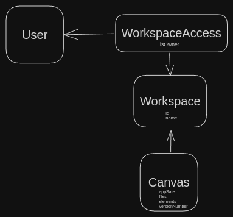

<p align="center">
  <a href="http://nestjs.com/" target="blank"></a>
</p>

## Description

ExcaliStudio Back-End repository

## Installation

```bash
$ pnpm install
```

## Running the app

```bash
# development
$ pnpm run start

# watch mode
$ pnpm run start:dev

# production mode
$ pnpm run start:prod
```

## Test

```bash
# unit tests
$ pnpm run test

# e2e tests
$ pnpm run test:e2e

# test coverage
$ pnpm run test:cov
```

## Auth flow

1. http://localhost:3000/api/auth/google/login
2. http://localhost:3000/api/auth/status
3. http://localhost:3000/api/user/me





### Default DB config
* DB type: `postgres`
* host: `localhost`
* name: `excali_studio`
* username: `excali_studio`
* password: `excali_studio`

